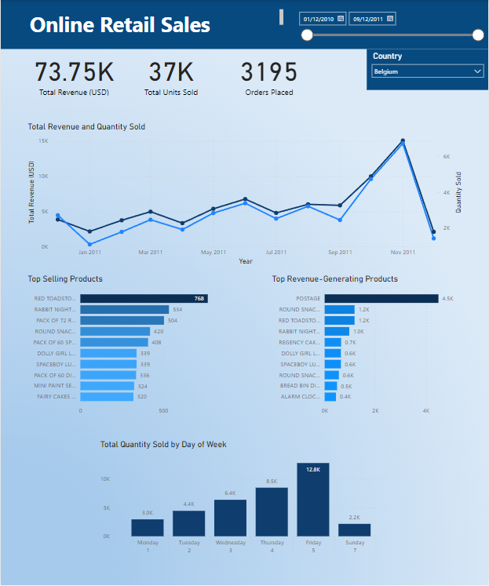

## Introduction
This project focuses on analysing an online retail dataset using SQL to derive insights and build a normalised database schema. The dataset includes information about invoices, products, customers, and countries.

Simple queries are first performed to find total revenue by country, top selling products etc before moving on to more complex queries using subqueries, window functions, CTEs, stored procedures, and temp tables.

Following analysis in SQL, the database is imported into Power BI where an interactive dashboard is created to clearly illustrate key relationships and patterns.

## Tools Used
- **SQL Server** for database management and executing SQL queries.
- **GitBash** for version control and managing the repository.
- **Power BI** for visualising insights and dashboard creation.
- **VSCode** for editing the readme markdown file.

## Schema Creation in SQL 
The initial dataset is a single CSV file, which is imported into SQL Server as one table.

**Table creation.** Here a table is created with columns defined as VARCHAR initially for flexible data import.
```sql
-- Define and populate initial table from CSV file
USE Online_Retail;

CREATE TABLE full_dataset (
    InvoiceNo VARCHAR(25) NOT NULL,
    StockCode VARCHAR(25) NOT NULL,
    Description VARCHAR(50) NOT NULL,
    Quantity VARCHAR(25) NOT NULL,
    InvoiceDate VARCHAR(25) NOT NULL,
    UnitPrice VARCHAR(25) NOT NULL,
    CustomerID VARCHAR(25) NOT NULL,
    Country VARCHAR(50)
);
```
**Population.** Bulk insert is used to load data directly from the CSV file into the full_dataset table.
```sql
BULK INSERT Online_Retail.dbo.full_dataset
FROM 'C:\Users\Charl\Desktop\Online_Retail\Online Retail.csv'
WITH (
    FIELDTERMINATOR = ',',     
    ROWTERMINATOR = '\n',    
    FIRSTROW = 2              
);
```
**Initial cleaning and data type conversion**
Incorrect entries are removed after being identified: rows where quantity cannot be converted to INT are removed. Then quantity, unit price and date columns are converted to appropriate formats.
```sql
DELETE FROM Online_Retail.dbo.full_dataset
WHERE TRY_CAST(Quantity AS INT) IS NULL;

ALTER TABLE Online_Retail.dbo.full_dataset
ALTER COLUMN Quantity INT;

ALTER TABLE Online_Retail.dbo.full_dataset
ALTER COLUMN UnitPrice FLOAT;

UPDATE Online_Retail.dbo.full_dataset
SET InvoiceDate = CONVERT(DATE, InvoiceDate, 103); 
```
**Data Normalisation.**
The initial dataset is normalised into five tables which are linked by primary and foreign keys, to ensure efficient storage and data integrity. 

Five tables are created with columns and data types specified, as well as keys and identities:
```sql
-- Create Countries Table
CREATE TABLE Countries (
    CountryID INT IDENTITY(1,1) PRIMARY KEY,
    CountryName VARCHAR(50)
);

-- Create Customers Table
CREATE TABLE Customers (
    NewCustomerID INT IDENTITY(1,1) PRIMARY KEY,
    CustomerID VARCHAR(25),
    CountryID INT,
    FOREIGN KEY (CountryID) REFERENCES Countries(CountryID)
);

-- Create Products Table
CREATE TABLE Products (
    ProductID INT IDENTITY(1,1) PRIMARY KEY,
    StockCode VARCHAR(25),
    Description VARCHAR(100) 
);

-- Create Invoices Table
CREATE TABLE Invoices (
    InvoiceID INT IDENTITY(1,1) PRIMARY KEY,
    InvoiceNo VARCHAR(25),
    InvoiceDate DATE,
    NewCustomerID INT, 
    FOREIGN KEY (NewCustomerID) REFERENCES Customers(NewCustomerID)
);


-- Create OrderDetails Table
CREATE TABLE OrderDetails (
    OrderDetailID INT IDENTITY(1,1) PRIMARY KEY,
    InvoiceID INT,
    ProductID INT,
    Quantity INT, 
    UnitPrice FLOAT,
    FOREIGN KEY (InvoiceID) REFERENCES Invoices(InvoiceID),
    FOREIGN KEY (ProductID) REFERENCES Products(ProductID)
);
```
**Table Population**
Once the five tables are created and linked by keys, data from the full_dataset is inserted into the relevant tables based on column names.:
```sql
-- Populate Countries Table
INSERT INTO Countries (CountryName)
SELECT DISTINCT Country
FROM full_dataset;

-- Populate Customers Table
INSERT INTO Customers (CustomerID, CountryID)
SELECT DISTINCT f.CustomerID, c.CountryID
FROM full_dataset f
INNER JOIN Countries c ON f.Country = c.CountryName;

-- Populate Products Table
INSERT INTO Products (StockCode, Description)
SELECT DISTINCT StockCode, Description
FROM full_dataset;

-- Populate Invoices Table
INSERT INTO Invoices (InvoiceNo, InvoiceDate, NewCustomerID)
SELECT DISTINCT f.InvoiceNo, f.InvoiceDate, c.NewCustomerID
FROM full_dataset f
INNER JOIN Customers c ON f.CustomerID = c.CustomerID;

-- Populate OrderDetails Table
INSERT INTO OrderDetails (InvoiceID, ProductID, Quantity, UnitPrice)
SELECT i.InvoiceID, p.ProductID, f.Quantity, f.UnitPrice
FROM full_dataset f
INNER JOIN Invoices i ON f.InvoiceNo = i.InvoiceNo
INNER JOIN Products p ON f.StockCode = p.StockCode;
```
## SQL Analysis
Now that the normalised schema has been established, the data is ready to be queried. Various SQL techniques are utilised to retrieve the required data.

The first four queries are basic, using joins, groups and ordering to quickly identify key information. 

- **Finding total revenue by country in descending order:**
```sql
SELECT c.CountryName, SUM(od.Quantity * od.UnitPrice) AS TotalRevenue
FROM Countries c
JOIN Customers cu ON c.CountryID = cu.CountryID
JOIN Invoices i ON cu.NewCustomerID = i.NewCustomerID
JOIN OrderDetails od ON i.InvoiceID = od.InvoiceID
GROUP BY c.CountryName
ORDER BY TotalRevenue DESC;
```

- **Top 10 products by quantity sold**
```sql
SELECT TOP 10 p.Description AS Product, SUM(od.Quantity) AS TotalQuantity
FROM Products p
JOIN OrderDetails od ON p.ProductID = od.ProductID
GROUP BY p.Description
ORDER BY TotalQuantity DESC;
```

- **Total monthly revenue in date order:**
```sql
SELECT YEAR(i.InvoiceDate) AS Year, MONTH(i.InvoiceDate) AS Month, SUM(od.Quantity * od.UnitPrice) AS MonthlyRevenue
FROM Invoices i
JOIN OrderDetails od ON i.InvoiceID = od.InvoiceID
GROUP BY YEAR(i.InvoiceDate), MONTH(i.InvoiceDate)
ORDER BY Year, Month;
```

- **Top spending customers in descending order:**
```sql
SELECT cu.NewCustomerID, SUM(od.Quantity * od.UnitPrice) AS TotalRevenue
FROM Customers cu
JOIN Invoices i ON cu.NewCustomerID = i.NewCustomerID
JOIN OrderDetails od ON i.InvoiceID = od.InvoiceID
GROUP BY cu.NewCustomerID
ORDER BY TotalRevenue DESC;
```

- **CTE** for finding the total revenue from each country in descending order. This achieves the same result as the more simple query, but using a CTE allows multiple queries to be performed without having to repeat the joins each time:
```sql
WITH RevenueByCountry AS (
    SELECT
        c.CountryName,
        SUM(od.Quantity * od.UnitPrice) AS TotalRevenue
    FROM
        dbo.Countries c
        JOIN dbo.Customers cu ON c.CountryID = cu.CountryID
        JOIN dbo.Invoices i ON cu.NewCustomerID = i.NewCustomerID
        JOIN dbo.OrderDetails od ON i.InvoiceID = od.InvoiceID
    GROUP BY
        c.CountryName
)
SELECT
    CountryName,
    TotalRevenue
FROM
    RevenueByCountry
ORDER BY
    TotalRevenue DESC;
```

- **Stored Procedure** to find customer details from a specified country. Parameters are used to filter customer data based on a country name:
```sql
CREATE PROCEDURE GetCustomersByCountry
    @CountryName NVARCHAR(100)
AS
BEGIN
    SELECT C.NewCustomerID, C.CustomerID, Co.CountryName
    FROM dbo.Customers AS C
    JOIN dbo.Countries AS Co ON C.CountryID = Co.CountryID
    WHERE Co.CountryName = @CountryName;
END;

-- Example: Execute the stored procedure to get customers from Spain
EXEC GetCustomersByCountry @CountryName = 'Spain';
```

- **Subquery** to show total revenue for each invoice:
```sql
SELECT InvoiceID, InvoiceNo,
    (SELECT SUM(Quantity * UnitPrice)
     FROM dbo.OrderDetails
     WHERE InvoiceID = I.InvoiceID) AS TotalRevenue
FROM dbo.Invoices AS I
ORDER BY TotalRevenue DESC
```

- **Window Function** to show a 3-month rolling average of total monthly revenue:
```sql
SELECT
    InvoiceDate,
    SUM(Quantity * UnitPrice) AS MonthlyRevenue,
    AVG(SUM(Quantity * UnitPrice)) OVER (ORDER BY InvoiceDate ROWS BETWEEN 2 PRECEDING AND CURRENT ROW) AS MovingAvg
FROM dbo.Invoices AS I
JOIN dbo.OrderDetails AS OD ON I.InvoiceID = OD.InvoiceID
GROUP BY InvoiceDate
ORDER BY InvoiceDate;
```

- **Temp Table** to store monthly revenue. In this case it is used to find the month with the highest revenue. A temp table is used to store interim results for further analysis without data persisting permanently:
```sql
CREATE TABLE #MonthlyRevenue (
    Month DATE,
    TotalRevenue DECIMAL(18, 2)
);

INSERT INTO #MonthlyRevenue (Month, TotalRevenue)
SELECT
    DATEFROMPARTS(YEAR(I.InvoiceDate), MONTH(I.InvoiceDate), 1) AS Month,
    SUM(OD.Quantity * OD.UnitPrice) AS TotalRevenue
FROM
    dbo.Invoices I
    JOIN dbo.OrderDetails OD ON I.InvoiceID = OD.InvoiceID
GROUP BY
    YEAR(I.InvoiceDate), MONTH(I.InvoiceDate);

SELECT TOP 1 * FROM #MonthlyRevenue
ORDER BY TotalRevenue DESC;

-- Drop the temporary table
DROP TABLE #MonthlyRevenue;
```

## What I Learned
- **Geographical Revenue Analysis**:

    - Insight: Analysing total revenue by country provided insights into regional sales performance.
    - Application: Helps in strategic decision-making regarding market expansion or targeted marketing efforts based on revenue concentration.

- **Product Performance Evaluation**:

    - Insight: Identifying top-selling products by quantity highlighted popular items.
    - Application: Guides inventory management and marketing strategies.

- **Temporal Revenue Trends**:

    - Insight: Calculating monthly revenue trends illustrated seasonal variations or growth patterns.
    - Application: Supports forecasting and resource allocation based on historical sales data trends over time.

- **Customer Spending Patterns**:

    - Insight: Ranking customers by spending provided insights into high-value clients.
    - Application: Facilitates customer relationship management (CRM) strategies to personalise marketing efforts and enhance customer retention.

- **Query Optimisation Techniques**:

    - Insight: Using CTEs and stored procedures improved query efficiency and reusability.
    - Application: Enhances database performance and streamlines complex data retrieval tasks for ongoing analytics and reporting needs.

- **Advanced Analytical Tools**:

    Insight: Employing window functions for calculating rolling averages enhanced data analysis capabilities.
    Application: Supports dynamic insights into trends and patterns, facilitating proactive decision-making based on real-time data analysis.

## Dashboard Development in Power BI
Now that multiple queries have been performed on the database, it is imported into Power BI where visualisations are created based on the insights gained in SQL, and further data analysis is performed.



- This dashboard displays KPIs as cards at the top of the report for quick insights into important metrics.
- A line graphs clearly shows the evolution of revenue and quantity sold over time.
- Top selling and top revenue-generating products are illustrated as bar charts to highlight the strongest performing products.
- Finally, a bar chart shows sales performance by the day of week.
- Slicers are included to filter the data by time and country for more granular analysis.